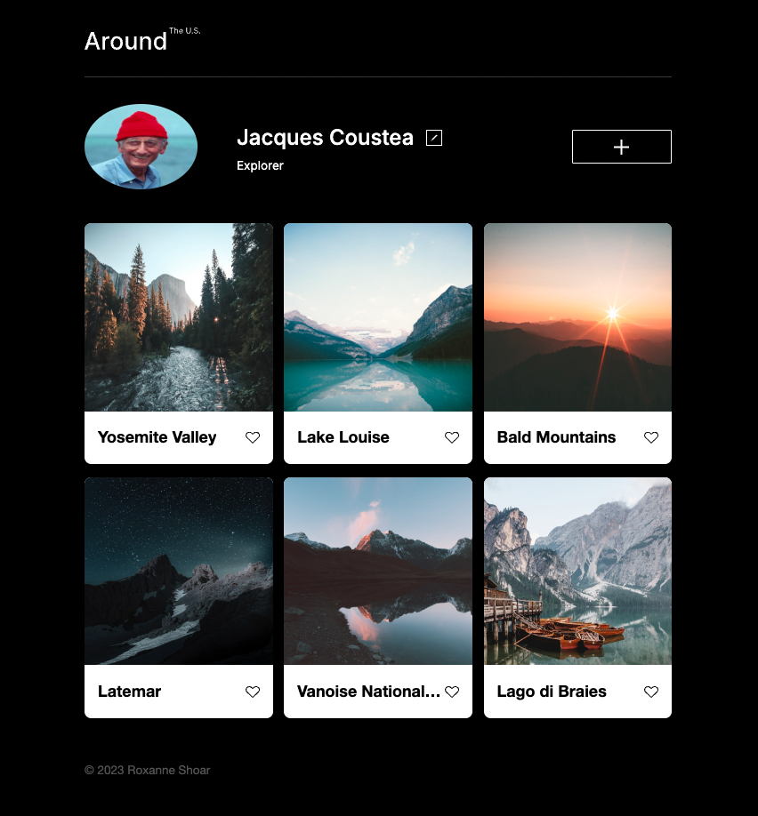

# Project 3: Around The U.S.

### Overview
- Intro 
- Skills & Technologies
- Future Directions 
- Demo Video & Screen Shot

## Intro
This was the third project for my program in software enginnering at TripleTen bootcamp. It follows a sequence of lessons that were aimed at mastering the art of responsive web design.

Time to complete: 25-30 hrs (across 6 days)

 **👉[  Live Demo]( https://roxannecodes.github.io/Project-3-around_the_US/)**

  
## Skills & Technologies

**🔳 Responsive web design**

This project was built using the **desktop-first** model and made to be fully responsive to all screen sizes by targeting break points for the tablet and mobile displays. This effect was achieved using the following features in CSS:
- **Media queries**
- **Flexbox**
- Adaptive features of **CSS grid**

 **🔳 Figma**
 - The **design** and specifications for this project were obtained entirely from  👉 [**This Figma File**](https://www.figma.com/file/ii4xxsJ0ghevUOcssTlHZv/Sprint-3%3A-Around-the-US?node-id=0%3A1).

 - **Images** were directly exported from Figma and optimized via [tinypng](https://tinypng.com/), so the project loads faster. 

   
  **🔳 BEM methodology**
  - A systematic way to structure the project by naming parent elements as **blocks** and further assigning class names to the elements which fall under them.
  - Organizing the layout into separate CSS files based on individual blocks

 **🔳 Advanced CSS grid**

Althought the project uses somewhat of a rudimentary level of CSS grid, the lessons of this sprint went into elaborate details of most, if not all available features of this technolgy.

## Future directions

Given that this project was made with pure CSS, the buttons are not yet functional. In the next sprint or two we will be introducing javascript into the mix by using the DOM to bring the key features of the page to life by allowing users to interact with following:
- Profile edit button
- Adding a card button
- Like button on individual cards

## Demo Video
In this [**Video**]( https://www.loom.com/share/116257335dac476888dbb0119c9a8c25?sid=6584214d-0da8-435c-a61f-2b38beb52e55) I will be showing you the project after deployment and focusing on demonstrating it's responsiveness to different screen sizes and the methods used to achieve this key effect.

### [ **👉 Project Demo Video**](https://www.loom.com/share/116257335dac476888dbb0119c9a8c25?sid=6584214d-0da8-435c-a61f-2b38beb52e55 )
 

  ## Screen Shot
 

